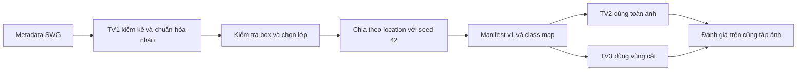
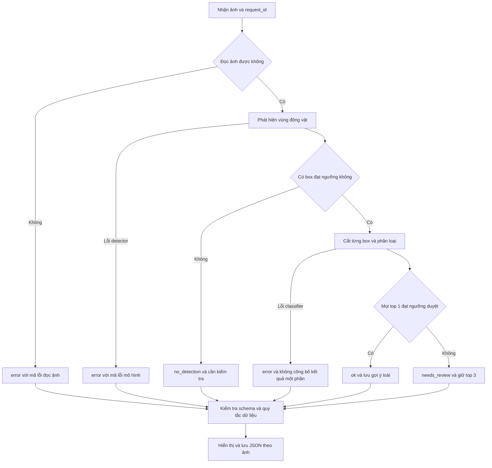

# Cấu trúc dự án và sơ đồ luồng

## Cấu trúc hiện có

```text
Camera-Trap-ML/
  configs/                 Cấu hình split, seed
  contracts/               JSON Schema cho kết quả suy luận
  coordination/            Tài nguyên và lượt đăng ký GPU
  data/processed/v1/       Manifest và class map dùng chung
  docs/                    Hướng dẫn và checklist bàn giao
  examples/results/        Kết quả giả lập cho TV2, TV3, TV4
  notebooks/               Notebook EDA
  reports/eda/             Báo cáo và biểu đồ đã tính
  scripts/                 Các lệnh xử lý metadata và kiểm tra dữ liệu
  tests/                   Kiểm thử tự động
  requirements.txt         Phụ thuộc của phần đã triển khai
```

Các thư mục local `data/raw`, `data/interim`, `data/images`, `.venv`, `outputs`, `runs` không được push. `outputs` dành cho kết quả demo xuất ra; `runs` dành cho log/checkpoint. Khi có code thật ở tuần 2, TV4 thêm thư mục ứng dụng, TV2/TV3 thêm module huấn luyện và suy luận theo cùng hợp đồng JSON.

## Luồng dữ liệu nghiên cứu đã triển khai



TV2 và TV3 chưa huấn luyện trong gói bàn giao này. Nhãn thật trong manifest phục vụ nghiên cứu, không được coi là dự đoán của mô hình và không đưa vào đường suy luận để quyết định kết quả.

## Luồng ứng dụng đã thống nhất cho bước tích hợp



`no_detection` chỉ có nghĩa detector không trả box đạt ngưỡng, không chứng minh ảnh trống. Đầu ra `ok` cũng chỉ là gợi ý từ mô hình. Luồng giao diện, detector và classifier thật sẽ được xây ở tuần sau; tuần 1 chỉ có schema, ví dụ và validator.

## Ranh giới tích hợp

| Bên cung cấp | Bên nhận | Định dạng |
|---|---|---|
| TV1 | TV2 và TV3 | Manifest JSONL, class_map.json, location_split.json |
| TV2 và TV3 | TV4 | Checkpoint, preprocessing, class map/version và kết quả theo schema |
| TV4 | Giao diện và xuất file | Một JSON kết quả cho mỗi ảnh; batch là danh sách các kết quả độc lập |
| Người kiểm tra | Nhóm | Nhận xét trên PR và checklist nghiệm thu |

Model ID, ngưỡng, ánh xạ nhãn và quy tắc preprocessing phải được lưu cùng checkpoint khi tích hợp. Mọi ảnh trong một batch đều phải có kết quả hoặc lỗi; một ảnh lỗi không làm mất kết quả các ảnh còn lại.
