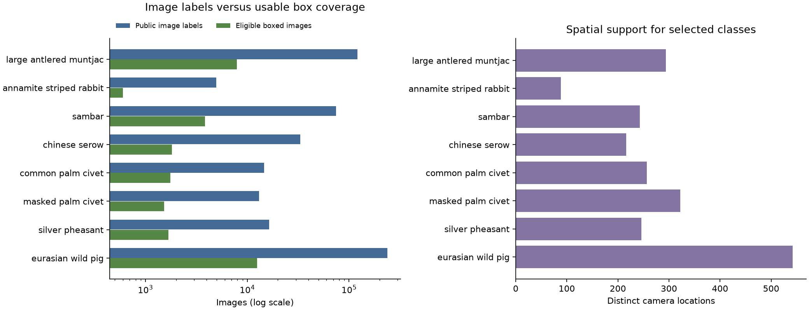
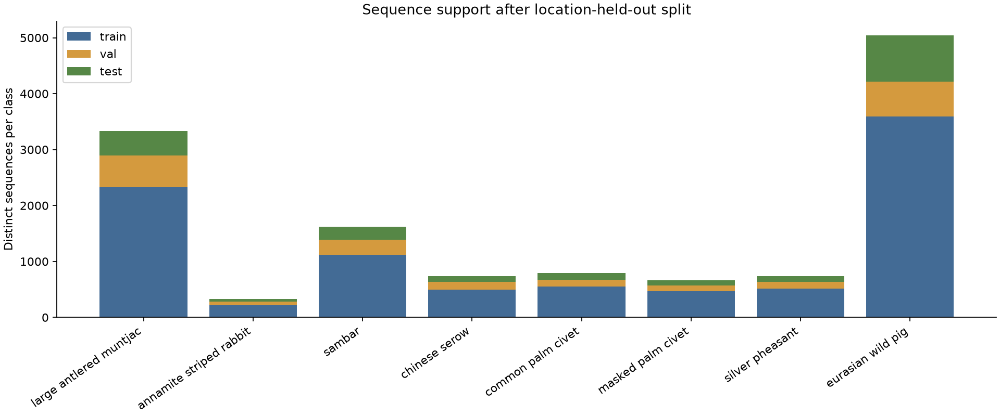

# EDA và manifest v1 cho thành viên 1

## Kết quả bàn giao

Đã đọc metadata gốc, thống kê toàn bộ nhãn và chọn đề xuất 8 lớp cho bài toán so sánh toàn ảnh với vùng cắt. Manifest chính có **31,589 ảnh**, pilot có **4,000 ảnh**. Chưa tải ảnh thực tế và chưa huấn luyện mô hình.

Đây là tập đề xuất dựa trên mức hỗ trợ dữ liệu, chưa phải danh sách xác nhận tình trạng bảo tồn. Hai ứng viên trọng tâm là `large_antlered_muntjac` và `annamite_striped_rabbit`; các lớp còn lại tạo bài toán đối chứng và phân biệt loài.

## Thống kê metadata gốc

| Chỉ tiêu | Số lượng |
|---|---:|
| Bản ghi ảnh | 2,039,657 |
| Chuỗi ảnh | 436,617 |
| Địa điểm camera | 982 |
| Nhãn gốc | 120 |
| Nhãn sau chuẩn hóa | 119 |
| Bản ghi nhãn ảnh | 2,056,006 |
| Đường dẫn public | 1,858,303 |
| Đường dẫn private | 181,354 |
| Ảnh đánh dấu corrupt | 1,749 |
| Ảnh có nhiều nhãn chuẩn hóa | 12,390 |
| Annotation ở cấp chuỗi | 2,056,006 |
| Bản ghi trong file annotation box | 133,837 |
| Box hợp lệ theo kiểm tra tọa độ | 101,384 |
| Ảnh có ít nhất một box hợp lệ | 87,921 |

File box chứa 32,178 annotation không có tọa độ, và 275 box vượt biên hoặc có kích thước không hợp lệ. Vì vậy số annotation trong file không đồng nghĩa với số bounding box sử dụng được.

Tên bộ dữ liệu trên trang giới thiệu không được dùng thay cho kiểm kê dữ liệu tải về. Bản metadata 1.1 tải trong lần này được ghi nhận bằng URL, ETag, thời điểm tải và SHA-256 trong `data/raw/sources.json`.

### Phạm vi quốc gia và thời gian

| Quốc gia theo đường dẫn | Public | Ảnh | Địa điểm |
|---|---|---:|---:|
| lao | False | 157,635 | 802 |
| lao | True | 1,388,412 | 756 |
| vietnam | False | 23,719 | 172 |
| vietnam | True | 469,891 | 179 |

Số địa điểm ở các hàng public/private có thể chồng lặp, không cộng các hàng này thành tổng địa điểm.

Phân bố năm trong metadata: 2011: 235 ảnh, 2012: 310 ảnh, 2015: 5,585 ảnh, 2016: 3,645 ảnh, 2017: 76,216 ảnh, 2018: 782,456 ảnh, 2019: 605,646 ảnh, 2020: 565,562 ảnh, None: 2 ảnh.

## Quy tắc làm sạch

1. Chuẩn hóa chữ thường, khoảng trắng và dấu gạch dưới. Gộp `chinese serow` với `chinese_serow`; lưu nhãn gốc và không gộp các loài khác nhau.
2. Loại `empty`, `ignore`, `problem`, `blurred`, `human`, `vehicle`, động vật nuôi và các nhãn `unidentified*` khỏi ứng viên phân loại loài. Các nhóm chưa rõ loài như `pangolin`, `ferret_badger`, `roosevelts_muntjac_group` được đánh dấu cần xem xét taxonomy.
3. Manifest chỉ lấy đường dẫn public, không đánh dấu corrupt, có kích thước ảnh dương, seq_id và location đầy đủ, đúng một nhãn ảnh chuẩn hóa thuộc lớp đã chọn.
4. Tọa độ dùng dạng COCO pixel `[x, y, width, height]`. Loại box không hữu hạn, kích thước không dương, vượt biên hơn 1 pixel hoặc annotation box cấp chuỗi. Sai lệch biên tối đa 1 pixel được cắt về mép ảnh.
5. Mỗi ảnh cần có ít nhất một box hợp lệ, mọi annotation box của ảnh phải hợp lệ và đồng ý với nhãn ảnh. Nhờ đó B1 và B2 dùng cùng ảnh có nhãn nhất quán. Các trường hợp nhiều loài hoặc xung đột nhãn được loại khỏi tập so sánh.
6. Annotation ảnh có thể ở cấp chuỗi; manifest giữ cờ này. Với tập so sánh, box cấp ảnh là nguồn xác nhận bổ sung, nhưng vẫn cần kiểm tra ảnh trực quan ở tuần 1 và tuần 2.

## Danh sách lớp đề xuất

| Class ID | Nhãn | Ảnh public theo nhãn | Ảnh đủ điều kiện | Chuỗi | Địa điểm |
|---:|---|---:|---:|---:|---:|
| 0 | large_antlered_muntjac | 120,862 | 7,921 | 3,327 | 294 |
| 1 | annamite_striped_rabbit | 4,955 | 602 | 332 | 88 |
| 2 | sambar | 74,834 | 3,831 | 1,625 | 243 |
| 3 | chinese_serow | 33,057 | 1,814 | 741 | 216 |
| 4 | common_palm_civet | 14,612 | 1,753 | 790 | 257 |
| 5 | masked_palm_civet | 13,081 | 1,528 | 663 | 322 |
| 6 | silver_pheasant | 16,420 | 1,685 | 739 | 246 |
| 7 | eurasian_wild_pig | 237,327 | 12,455 | 5,041 | 542 |

- `large_antlered_muntjac`: Ứng viên trọng tâm; nhiều ảnh có box và nhiều địa điểm.
- `annamite_striped_rabbit`: Ứng viên trọng tâm; ít mẫu hơn nhưng có đủ chuỗi và địa điểm cho ba tập.
- `sambar`: Lớp thú móng guốc để so sánh với mang và sơn dương.
- `chinese_serow`: Kiểm tra khả năng phân biệt thú móng guốc; đã gộp hai cách viết cùng nhãn.
- `common_palm_civet`: Lớp đối chứng trong nhóm cầy.
- `masked_palm_civet`: Lớp dễ nhầm với common_palm_civet, hữu ích cho phân tích lỗi.
- `silver_pheasant`: Bổ sung nhóm chim cho tập phân loại.
- `eurasian_wild_pig`: Lớp phổ biến để quan sát mất cân bằng và làm đối chứng.

Các lớp ít mẫu cần giữ ở phần thảo luận, không tự hứa mô hình sẽ nhận dạng tốt:

| Nhãn | Ảnh đủ điều kiện | Chuỗi | Địa điểm |
|---|---:|---:|---:|
| owstons_civet | 27 | 11 | 4 |
| asiatic_black_bear | 69 | 25 | 22 |
| red_shanked_douc | 128 | 60 | 49 |
| sun_bear | 16 | 7 | 7 |

## Thiết kế split

Seed = **42**. Nhóm theo `location`, mục tiêu 70% train, 15% validation, 15% test theo số địa điểm. Dùng 2.000 hoán vị PCG64 và chọn phương án giảm sai lệch tỷ lệ ảnh và chuỗi từng lớp. Chỉ dùng metadata nhãn, không dùng kết quả mô hình để chọn split.
Mỗi lớp phải có ít nhất 10 chuỗi và 2 địa điểm trong từng tập. Do nhóm theo địa điểm, tỷ lệ ảnh thực tế không cần đúng tuyệt đối 70/15/15. Đây là ngưỡng kiểm tra khả thi, không bảo đảm độ tin cậy thống kê cao cho lớp ít mẫu.

| Tập | Ảnh | Tỷ lệ ảnh |
|---|---:|---:|
| train | 22,073 | 69.88% |
| val | 4,835 | 15.31% |
| test | 4,681 | 14.82% |

| Nhãn | Train ảnh / chuỗi | Val ảnh / chuỗi | Test ảnh / chuỗi |
|---|---:|---:|---:|
| large_antlered_muntjac | 5568 / 2327 | 1375 / 567 | 978 / 433 |
| annamite_striped_rabbit | 397 / 215 | 122 / 66 | 83 / 51 |
| sambar | 2732 / 1119 | 576 / 269 | 523 / 237 |
| chinese_serow | 1226 / 493 | 320 / 139 | 268 / 109 |
| common_palm_civet | 1210 / 548 | 299 / 126 | 244 / 116 |
| masked_palm_civet | 1070 / 472 | 251 / 102 | 207 / 89 |
| silver_pheasant | 1156 / 517 | 290 / 119 | 239 / 103 |
| eurasian_wild_pig | 8714 / 3594 | 1602 / 624 | 2139 / 823 |

Pilot lấy tối đa 500 ảnh mỗi lớp theo tỷ lệ mục tiêu, giữ nguyên split của manifest chính. Pilot chỉ dùng để thử đọc ảnh và chạy code; không thay thế tập test chính và không đại diện cho phân bố thực địa. Không dùng nhãn pilot test để tinh chỉnh mô hình.

## Kiểm tra rò rỉ và trùng lặp

- Image ID trùng trong manifest: 0. Đường dẫn ảnh trùng: 0.
- Giá trị `image_id` xuất hiện ở nhiều split: 0.
- Giá trị `file_name` xuất hiện ở nhiều split: 0.
- Giá trị `seq_id` xuất hiện ở nhiều split: 0.
- Giá trị `location` xuất hiện ở nhiều split: 0.
- Sai khác metadata ảnh giữa hai nguồn: 0; ảnh nguồn box không tìm thấy trong nguồn chính: 0.
- Kiểm tra trên toàn bộ metadata: duplicate_file_paths=0, sequences_spanning_locations=0, annotations_missing_image=0, annotations_unknown_category=0, images_without_label=0.
- **Chưa kiểm tra trùng nội dung ảnh** bằng SHA-256 hoặc perceptual hash vì chưa tải ảnh. Cũng chưa xác nhận URL còn tải được, file giải mã được hay box chính xác về mặt thị giác. Đây là phần kiểm tra tiếp theo của TV1 và TV3, không coi là đã hoàn thành.

## Tệp bàn giao và cách sử dụng

- `reports/eda/class_statistics.json`: thống kê mọi nhãn, cả nhãn bị loại; `summary.json`: tổng quan và kiểm tra dữ liệu.
- `data/processed/v1/selected_classes.json`: danh sách lớp và lý do; `class_map.json`: ánh xạ class ID dùng chung.
- `manifest_v1.jsonl`: mỗi dòng là một ảnh, có ID, đường dẫn, chuỗi, địa điểm, nhãn, split, kích thước và danh sách box.
- `train.jsonl`, `val.jsonl`, `test.jsonl`: bản tách sẵn của cùng manifest; `pilot_v1.jsonl`: tập thử nhỏ.
- `location_split.json`, `provenance.json`, `audit.json`: lưu phân nhóm, cấu hình, seed, nguồn và kết quả kiểm tra.
- `notebooks/01_metadata_eda.ipynb`: notebook đọc các thống kê đã xuất, có thể dùng để trình bày EDA.

TV2 và TV3 phải dùng cùng manifest và class_map. Không tự random lại ảnh. Khi dữ liệu hoặc quy tắc thay đổi, tạo phiên bản v2 và giữ v1 để so sánh; sau khi khóa thí nghiệm, chỉ dùng validation để chọn mô hình và ngưỡng.

## Giới hạn cần trình bày

Kết quả split chỉ chứng minh tách biệt các mã địa điểm trong SWG; không chứng minh hai vị trí gần nhau ngoài thực địa độc lập. Tập có box là một tập con được gán nhãn chọn lọc, không đại diện ngẫu nhiên cho toàn bộ ảnh SWG. Nhãn ưu tiên bảo tồn cần được kiểm chứng riêng bằng nguồn chuyên môn; số mẫu ít không đồng nghĩa với tình trạng nguy cấp.

## Nguồn

- SWG (2021), Northern and Central Annamites Camera Traps 2.0: https://lila.science/datasets/swg-camera-traps
- COCO Camera Traps và quy ước annotation: https://github.com/agentmorris/MegaDetector/blob/main/megadetector/data_management/README.md#coco-camera-traps-format
- URL và checksum của hai gói tải về: `data/raw/sources.json`.

SHA-256 manifest chính: `8639e2920567cec6d8aaf7ddaed9a3deb8f0c774e7a6ca87dbe591ba3562d48a`
